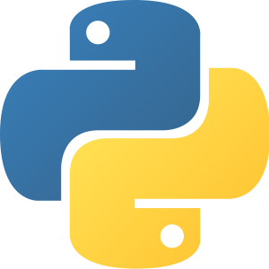

# Curso básico de python

en este curso aprenderás a programar en python

**Requisitos**
-python 4.6 o superior
-computadora con windows, linux o macOs
-editor de texto como [visual estudio code](https://code.visualstudio.com/).-----------------
-------